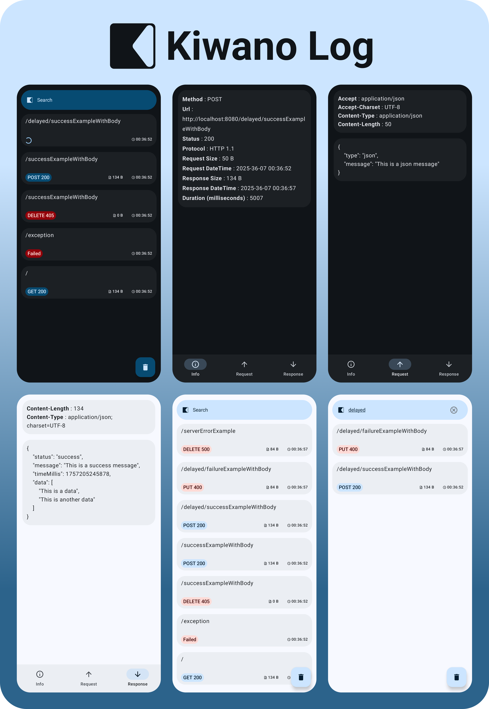

<div align="center">
    
</div>


A lightweight **logging library for Ktor Client on Android**.  
Kiwano Log logs HTTP requests/responses and shows them as **system notifications**.  
When you open the notification, you can view full request/response details in a clean UI.  

---

## ✨ Features
- 📡 Logs all Ktor Client HTTP requests and responses  
- 🔔 Shows notifications for each request  
- 📑 Open notifications to see detailed request/response info  
- ⚡ Lightweight and easy to integrate

---

## 📦 Installation

Add the dependency to your `build.gradle`:

```gradle
dependencies {
    debugImplementation("com.ehsanmsz:kiwano-log:0.1.6")
    releaseImplementation("com.ehsanmsz:kiwano-log-no-op:0.1.6")
}
```

# 🚀 Usage

Install KiwanoLog in your Ktor client:

```kotlin
val client = HttpClient(Android) {
    kiwanoLog(context)
}
```

That’s it!

⚠️ **Note:** Ensure that the app has **notification permission** granted, otherwise Kiwano Log cannot display request logs as notifications.


# 📜 License
```
   Copyright 2024 Ehsan Msz

   Licensed under the Apache License, Version 2.0 (the "License");
   you may not use this file except in compliance with the License.
   You may obtain a copy of the License at

       http://www.apache.org/licenses/LICENSE-2.0

   Unless required by applicable law or agreed to in writing, software
   distributed under the License is distributed on an "AS IS" BASIS,
   WITHOUT WARRANTIES OR CONDITIONS OF ANY KIND, either express or implied.
   See the License for the specific language governing permissions and
   limitations under the License.
```
